<p align="center">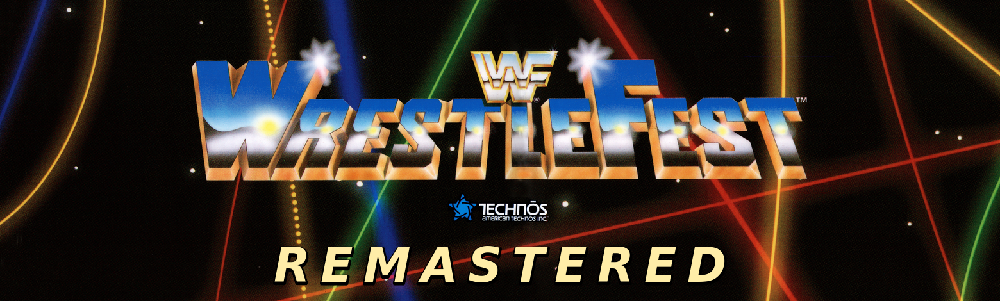</p>

A native, from-scratch C/SDL2 engine for Technos' 1991 arcade game **WWF WrestleFest**,
transcribed from the 68000 program with MAME as the oracle, plus a data pipeline that
turns the game into editable JSON and PNG, a **mod system** (stacking rule layers,
clones, skins, arenas, scenes, sounds), an in-engine **editor**, and an AI art pipeline
that draws new wrestler skins with codex.

The ROM is **not** included. You need your own MAME `wwfwfest` set; the engine reads
every table, tile and sprite out of it once (see *Clone and build*), and from then on
plays from its own packed data without ever opening the ROM again.

<p align="center">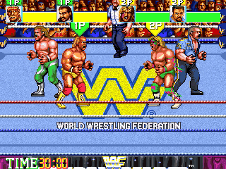</p>

## Clone and build

Linux, C11, SDL2, libpng. On Debian/Ubuntu:

```
sudo apt install build-essential libsdl2-dev libpng-dev
git clone https://github.com/ff-nullz/WWF-Wrestlefest-Remastered.git
cd WWF-Wrestlefest-Remastered
cp /path/to/wwfwfest.zip rom/  # the MAME ROM set (bootstrap unzips it)
tools/bootstrap.sh             # build + decode the ROM into data/ (~1 min)
./wfengine                     # play
```

`tools/bootstrap.sh` compiles the engine, then decodes the gfx, tables, wrestlers and
sound out of `rom/` into `data/` and packs them. The stock game opens in attract mode;
key **5** inserts a coin, **1** starts. `tools/bootstrap.sh --skins` also exports the
twelve stock men as editable skin sheets (`data/stockskins`, ~100 MB, a couple of
minutes) for the editor's Skins and Classes tabs. Music: the engine emulates the
original Z80 + YM2151 + OKI sound board, so every tune and sample plays from the ROM;
nothing to download.

```
./wfengine --profiles              # list the mod profiles
./wfengine --profile heavyhits     # play one (packs automatically when stale)
./wfengine --editor                # the editor
./build.sh                         # rebuild after editing src/ (bumps the version, packs)
make regress                       # the engine's self-test digest against baseline.txt
```

**Keys** (rebindable in the editor's Input tab, saved to `data/keymap.json`):

| | move | B1 | B2 | start | coin |
|---|---|---|---|---|---|
| P1 | arrows | A | Z | 1 | 5 |
| P2 | R F D G | Q | W | 2 | 6 |
| P3 | I K J L | Y | U | 3 | 7 |
| P4 | numpad 8 2 4 6 | numpad 0 | numpad Enter | 4 | 8 |

Both buttons together run. `--scale N`, `--fullscreen`, `--no-front` (skip the
front end straight into a match) are the useful flags; `--headless --frames N` runs the
engine with no window (the test harness).

## What lives where

```
├─ src/          the engine - one .c per subsystem; every handler cites its ROM address
├─ tools/        build, export, media and publish scripts (bootstrap.sh, gifs.sh, ...)
├─ docs/         engine specs, the modding guide, videos (docs/video), README media (docs/img)
├─ rom/          YOUR wwfwfest.zip goes here - read once by bootstrap, never distributed
├─ data/         the game as editable JSON + PNG, decoded from rom/ by bootstrap
├─ build/        the packed paks the engine actually loads (rebuilt by ./build.sh)
├─ mods/         one directory per mod, holding only the files it changes
├─ profiles/     launchable stacks of mods (JSON) - what --profile names
├─ skins/        the AI-drawn wrestler skins (Undertaker, Duggan)
├─ arenas/       arenas as PNG layers + the new-arena templates
└─ baseline.txt  the self-test digest gate (make regress)
```

## The game

Everything the arcade did: attract mode, game select, character select, the aisle
walk and ring entrance, the tag match, the Royal Rumble, ring-outs and the count, the
cage, the referee, tag run-ins and double teams, the continue screens, the ending.
The frame loop, the animation cells, the hit pipeline, the AI policy tables and the
ring laws are transcriptions of the 68000 routines (every handler in `src/` cites the
ROM address it came from), and a stock match is checked against a saved trace digest
on every build.

## Mods

A **profile** is a launchable version of the game: an ordered list of **mods**, each a
directory of only the files it changes. Rule mods are a handful of labelled rows and
they **stack** - two rule mods in one profile both apply. `wfengine --profiles` lists
them; the editor's Profiles tab creates and edits them.

| profile | what it does | |
|---|---|---|
| `heavyhits` | a human's hits, knees and throws do 3x damage |  |
| `parasitic` | every hit gives the energy it takes to the man who landed it | 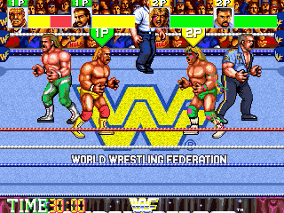 |
| `turbo` | the wrestlers walk, run and animate at 160%; clock and referee at real time | 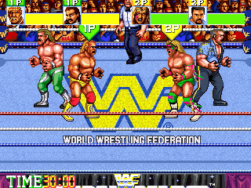 |
| `vampire-turbo` | parasitic + turbo stacked in one profile | 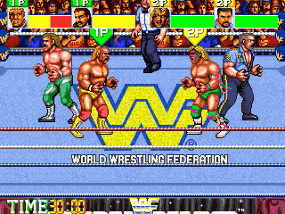 |
| `battle-royale-12` | all twelve stock wrestlers in the ring at the bell, no walk-ins, last man standing | 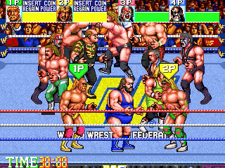 |
| `battle-royale` | 8-man bell, fast entrances | 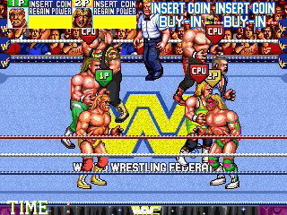 |
| `cagematch` | escape over the cage wall to win: hold DOWN into the bottom wall, climb hand over hand, drop outside | 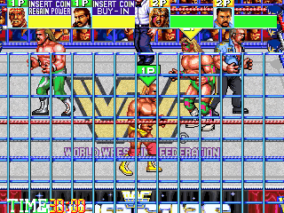 |
| `exit-ring` | hold into a rope for half a second to hop out to ringside | 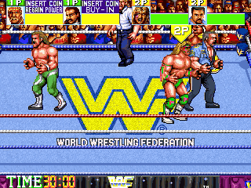 |
| `chaos` | random run-ins every few seconds + exit the ring at will (two mods stacked) | 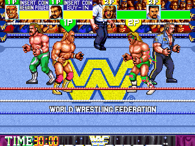 |
| `run-ins` | a wrestler who is not in the match runs down the aisle and brawls | 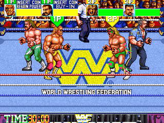 |
| `ref-ko` | strikes floor the referee; no counts until he gets up ("OH NO") | 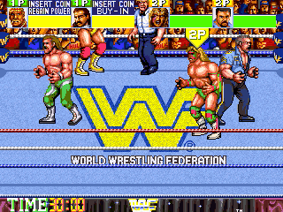 |
| `hardcore` | weapons come into the ring, no count-outs | 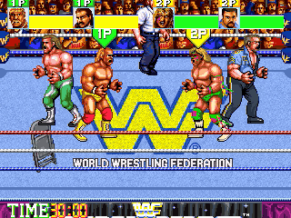 |
| `survivor` | 3-on-3 with elimination rules | 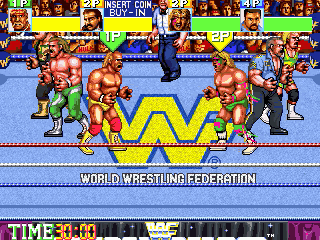 |
| `handicap` | you alone against a tag team | 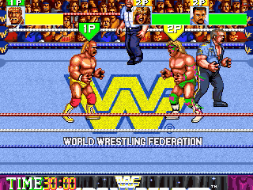 |
| `one-on-one` | singles, the tournament card | 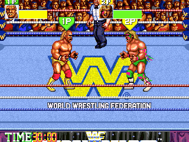 |
| `mirror` | pick the same wrestler twice, the second copy in an alternate outfit |  |
| `precision` | deterministic throws from the facelock: direction + button = the same move | 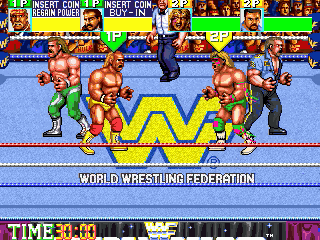 |
| `meters` / `gauge` | CPU energy meters on the HUD / a grapple gauge over a grappling pair |  |
| `widescreen` / `fixedview` | zoomed-out panning camera / a locked full-ring view | 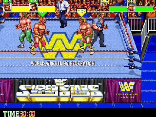 |
| `trainer` / `sandbox` | unlimited energy and no clock / endless run-in brawls, slow count | 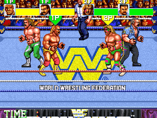 |
| `legends` | the Legion of Doom join the select grid | 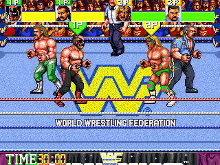 |
| `clones` | example clone slot: a re-palette Hogan | 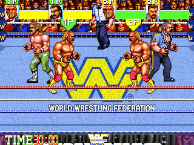 |

### The mods so far

One animated GIF per mod, each a scripted drive that makes the feature obvious. This is
just what has been built to date - a mod is a handful of labelled JSON rows, so the list
ends wherever the modding stopped, not where it can go (`docs/modding.md`).

| | |
|---|---|
| **Undertaker vs Duggan** - two AI-drawn skins, CPU vs CPU, in the `superstars` profile | **select_extended** - Hawk and Animal picked off the extended grid, played from the bell |
| 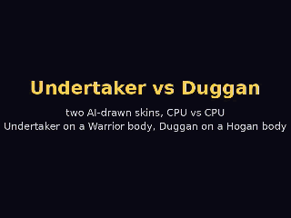 |  |
| **extended_moves** - a strike knocks the perched man off the buckle; he lands and gets up | **toprope_out** - the same knock-off, out of the ring |
| 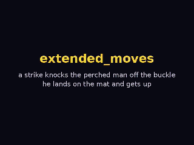 | 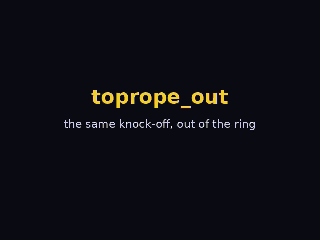 |
| **the rumble double pin** - B2 at a pile joins the cover (the stock behaviour, restored) | **cagematch** - hold DOWN into the bottom wall ~2 s, climb hand over hand, drop: WIN |
| 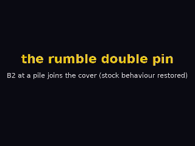 | 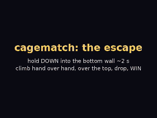 |
| **exit_ring** - hold into a rope for half a second to hop out | **exit_ring_climb** - ...or climb out through the ropes |
| 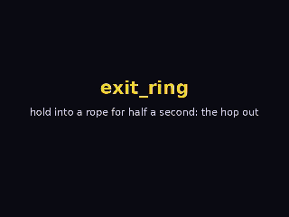 | 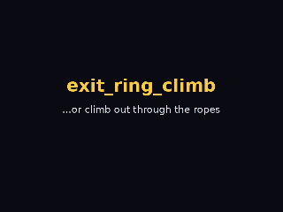 |
| **hardcore** - climb out, take the chair, carry it INTO the ring: one chair shot | **throw_out** - a bodyslam near the ropes throws the victim over the top |
| 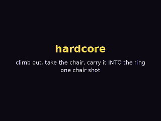 | 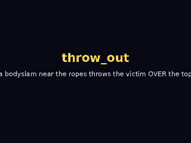 |
| **ref_knockdown** - a strike floors the referee: no counts until he is up | **parasitic_pct** - P1 starts at half energy; every hit refills his bar with what it takes |
| 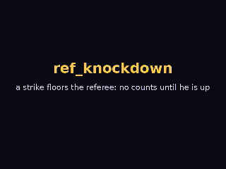 | 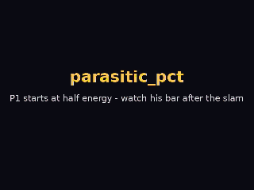 |
| **human_hit_mult** - a human's slam does 3x: the CPU's bar after one throw | **ko_dq** - energy 0 = OUT: at x9 damage one slam loses the match |
| 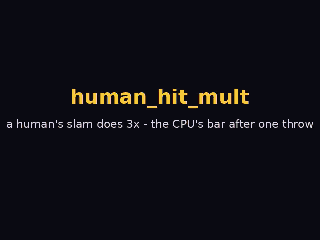 | 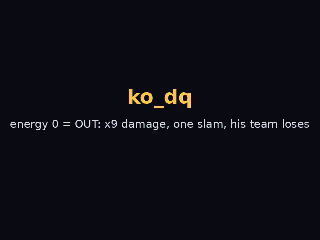 |
| **turbo** - the same inputs, stock on the left, turbo 5 on the right | **battle-royale-12** - all twelve at the bell, nobody walks in |
| 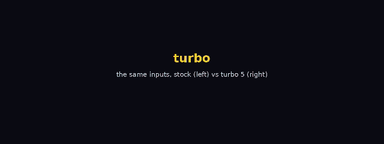 | 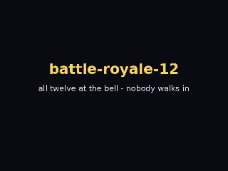 |
| **8-man rumble** - a man walks in after an elimination (the reclaimed palette bank) | |
| 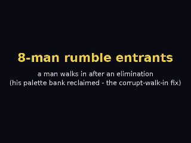 | |

Full-quality video (57.44 Hz, mp4): the same clips as [`docs/video/hl-<mod>.mp4`](docs/video/),
the whole set stitched in [highlights.mp4](docs/video/highlights.mp4) (3:22, 37 MB, download),
a 20 s CPU-vs-CPU match per profile as `docs/video/<profile>.mp4`, and
**[editor.mp4](docs/video/editor.mp4)** (2:45), a walk through every editor tab and sub-tab.
`tools/highlights.sh`, `tools/gifs.sh` and `tools/edvideo.sh` regenerate all of it headlessly.

Every switch a mod can flip is a row in `src/rules.def`, with its stock value and the
editor's help text; `wfengine --rules-doc` prints the full table. `docs/modding.md` is
the modding guide.

### New skins

A **skin** is a full set of frames for a body class, drawn by the AI art pipeline from
one reference image and the class's generic frames, then ingested into a clone slot
with its own name, palette, stats and announcer calls. Two are shipped in `skins/`
(Undertaker in the `superstars` mod, slot 13; Duggan in `wardrobe`, slot 12) and are
playable in the `superstars` profile:

| Undertaker (on a Warrior-class body) | Duggan (on a Hogan-class body) |
|---|---|
| 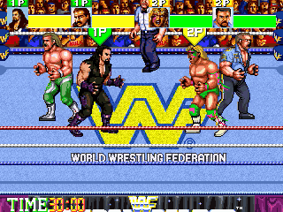 | 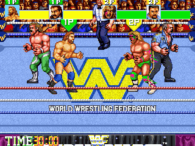 |


Both are picked in the game itself - the extended select grid, the walkout, the match:

| **Undertaker** picked and played (`superstars`) | **Duggan** picked and played (`wardrobe`) |
|---|---|
| 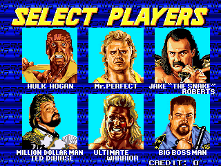 | 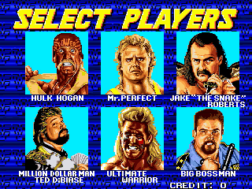 |

## The editor

`./wfengine --editor` opens the editor on the game's own data. It is written in C on
Nuklear, runs inside the engine, and every save goes to a mod layer - the stock data is
read-only by design, so the original game is always one launch away.

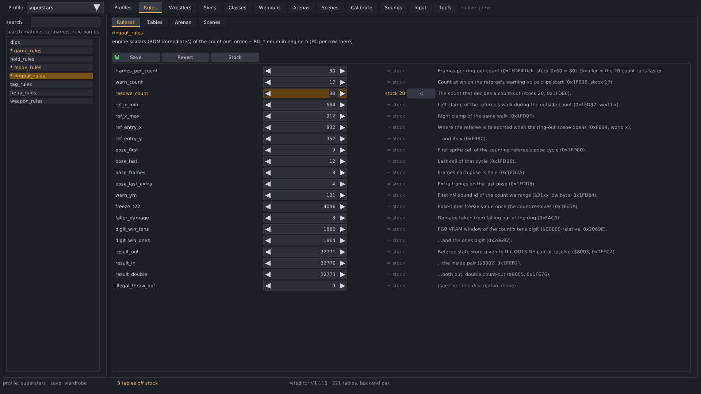

### Profiles

Create, stack and launch profiles. A profile is an ordered list of mods; the settings
page lists every rule the stack touches with its stock value marked, and Launch starts
the game on it.

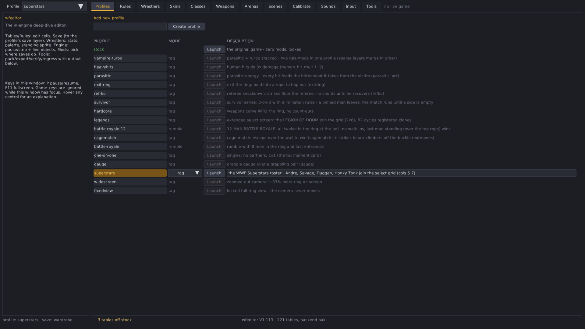

### Rules

The eight rule sets: game, mode, hold, tie-up, tag, ring-out, weapon and dips. Every
switch is a labelled row with its stock value and help text; rows off stock are
highlighted, and any row can be reverted or compared with stock.

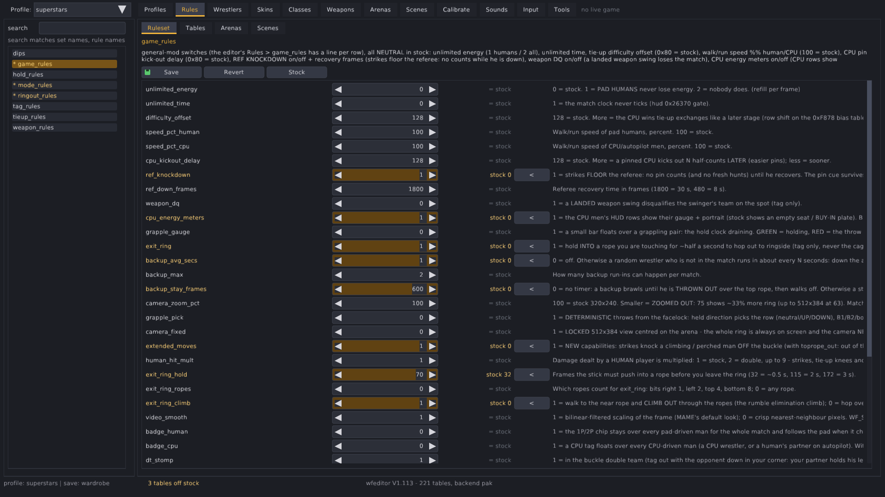
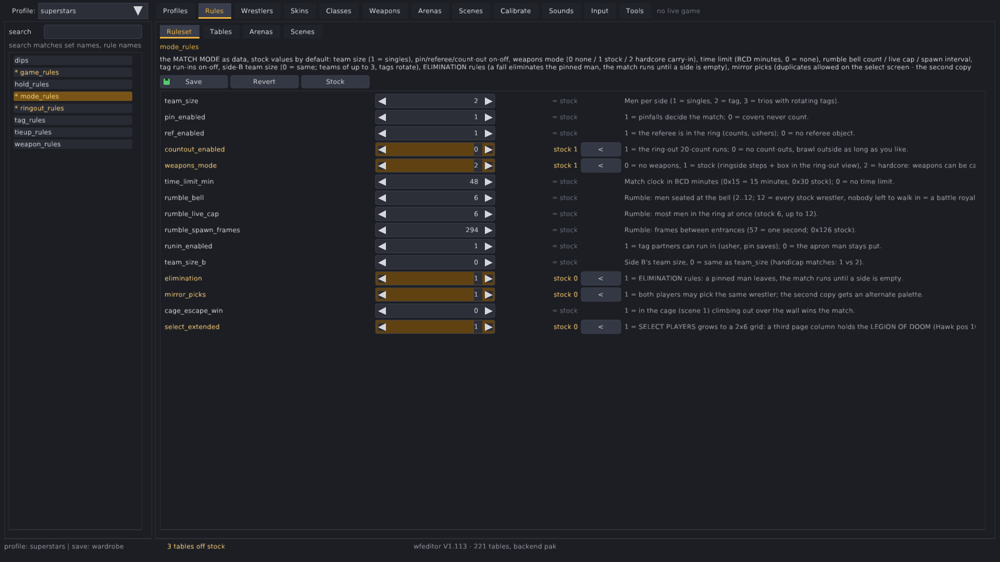

### Wrestlers

Stats, the move map, outfit palettes and announcer sounds per slot - the twelve stock
men and the clone slots (12-15) that carry skins and new characters.

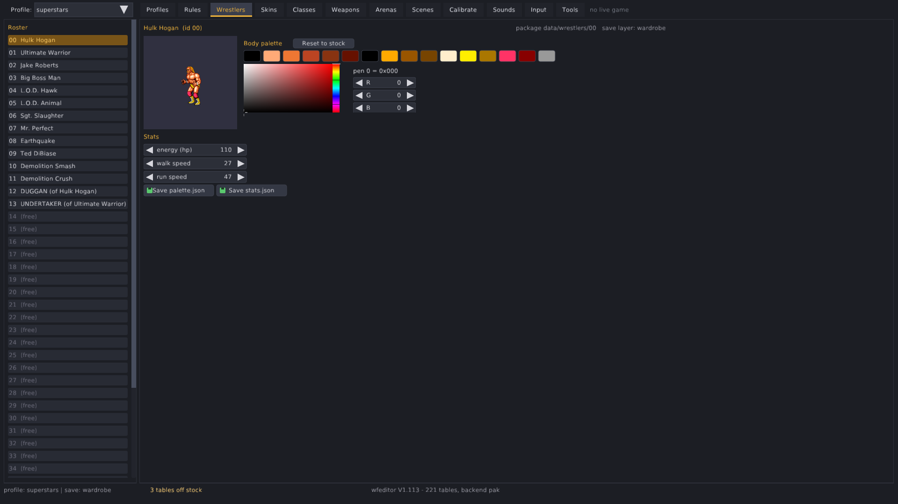
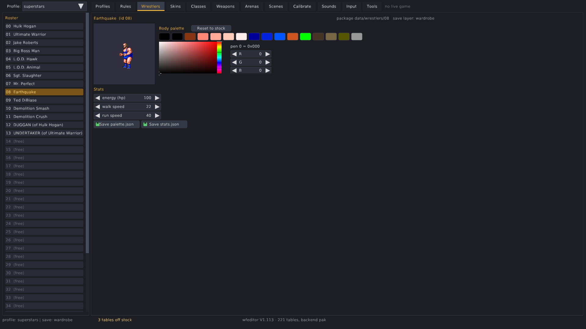
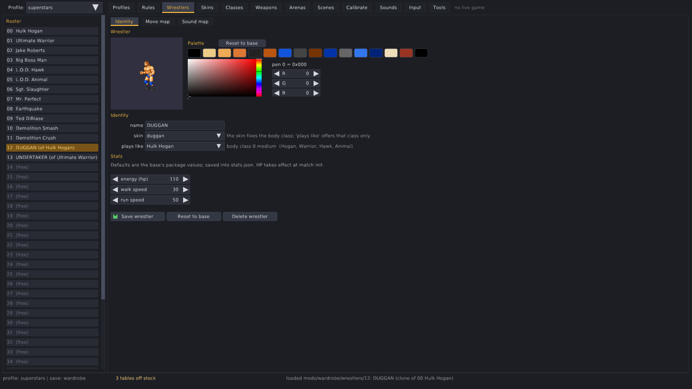
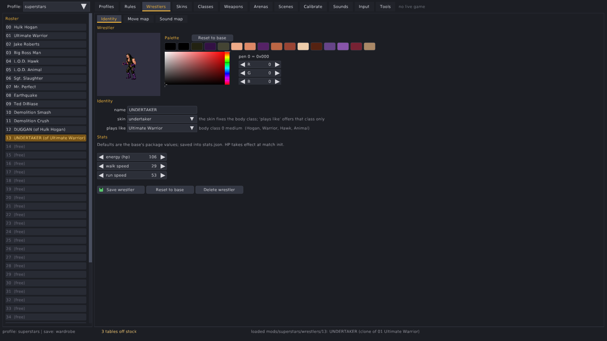

### Skins

The AI art pipeline end to end: a reference image and character description, the prompt
recipe, the pose generation queue, review, ingest into a clone slot, pack. This is the
tab that drew Undertaker and Duggan.

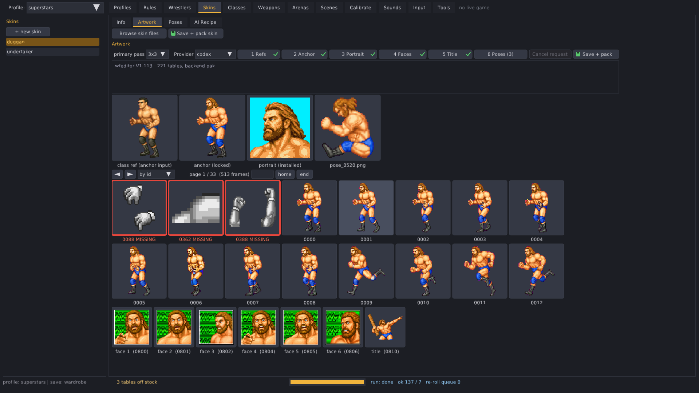


### Classes

The body classes and their generic frame sets - the skeletons a skin dresses. Pose
viewer, aliases and frame coverage per class.


### Weapons

Weapon types built from a PNG: the cells, attach points per pose, damage and palette.
The hardcore mod's chair lives here.


### Arenas

Arenas as PNG layers - crowd steps, ring, floor, ropes - plus new arenas from the
templates and the AI recipe that repaints a whole arena in one pass.


### Scenes

The between-match screens - walkout, title card, talk, belt, ending - as editable data:
tilemaps, picks, frame-triggered sounds, and a render preview.


### Calibrate

Grapple alignment per holder/held pair: offsets and depth, so a new skin's holds line
up like stock.


### Sounds

Every music command and sample played through the emulated Z80 + YM2151 + OKI board;
render any tune to WAV; per-wrestler name calls and intro phrases.


### Input

The keyboard map for all four players, saved to `data/keymap.json`.


### Tools

The batch tools: exports, verifies, packs and the regression gates.


### Codex integration

The art pipeline uses the `codex` CLI as its only image backend. `tools/codex_setup.sh`
checks the install and the login. Nothing in this repository carries a key: codex keeps
its own login under `~/.codex`, and the engine only shells out to it.

- **Skins.** A reference image plus a character description produce every pose the body
  class needs. The engine composes the request per pose (the class's generic frame, the
  magenta key, the pen palette), runs codex, keys and crops the answer, fills holes, aligns
  it to the anchor and scores fidelity. Poses that come back wrong go into a re-roll queue.
  The result is ingested as a clone slot and packed like any wrestler. `docs/ai-art-pipeline.md`.
- **Arenas.** An arena's layers can be repainted to a theme in one pass, with the first
  result used as the style anchor for the rest, then sliced back into the layer files by
  the original alpha.
- **Portraits and badges.** The select portrait, the continue-screen faces, the referee's
  knocked-down frames and the HUD chips go through the same key-and-crop tool.

## The engine

- **A transcription, not an emulator.** `src/` is the 68000 game logic rewritten in C,
  routine by routine, with the ROM address in a comment at every handler
  (`anim.c` cells and move handlers, `hit.c` the hit pipeline, `ai.c` the CPU policy,
  `motion.c` the ring laws, `referee.c`, `tag.c`, `rumble.c`, `tieup.c` ...). Object
  state keeps the ROM's layout with named fields and bits (`engine.h`).
- **ROM data leaves the ROM.** Every table the code reads is registered
  (`tbl_def`, 221 of them) and exported once to JSON; graphics to indexed PNG; sound
  ROMs to files. The game loads packed `.pak` files built from that source tree and
  never opens `rom/`. `docs/adr-001-data-formats.md`, `docs/data-pipeline.md`.
- **Sound.** The Z80 sound program, the YM2151 and the OKI M6295 are emulated in
  lockstep with the game loop: full-length music, the real samples. A mod can replace a
  tune with a WAV.
- **Mods live behind hooks.** Everything a rule changes in gameplay is in
  `src/modhooks.c` behind named hooks (`mod_fall_launch`, `mod_damage_taken`,
  `mod_exit_ring_gate` ...); the transcribed handlers call one hook per site. A new
  gameplay rule is one line in `src/rules.def` (enum, default, label, help are all
  generated from it) plus its hook.
- **Gates.** `make regress` hashes the engine state over a fixed 1200-frame drive.
  `tools/trace_gate.sh` records full per-frame traces over eight deterministic drives
  and proves a refactor changed nothing. `tools/mod_gate.sh` proves every mod still does
  its thing. `tools/ai_bench.sh` measures what the CPU actually does
  (`WF_AISTATS=1`).
- **Harness.** `--headless --drive script` with `WF_P1="start-end:bits,..."` scripts
  the pads frame by frame; `WF_TRACE`, `WF_DBGSEL`, `WF_X1/Y1/HP1`, `WF_MODRULES`,
  `WF_RUMBLE`, `WF_STAGE`, `WF_PINAT` poke the state. Every bug fixed in this
  repository has a headless repro line in the commit.

## Modding and hacking

- **Rules.** Flip a row in a mod's `tables/rules/game_rules.json`
  (`{"overrides": {"turbo": 3}}`) or use the editor. Rows stack across mods in profile
  order. `wfengine --sparsify MOD` rewrites a full layer into the sparse form.
- **Clones.** A clone slot is a `wrestler.json` naming its base, plus optional
  `palette.json`, `stats.json`, a move map, sounds. Slots 12 to 43.
- **Skins.** A clone with its own frames: the pipeline above, or hand-drawn PNGs per
  pose (`skins/<name>/frames/pose_NNNN.png`) ingested with `--art-ingest`.
- **Arenas.** `arenas/<name>/` is a set of PNG layers per view with an `arena.json`;
  `--new-arena` copies a template, `--pack-arena` packs it, a profile's `"arenas"` map
  assigns one per scene.
- **Scenes.** The interludes are tilemaps with picks and frame-triggered sounds under
  `scenes/<name>/`; the editor renders a preview.
- **Sounds and music.** `sounds/` is a WAV library; a wrestler's `sounds` map picks his
  name call and intro phrase; `mods/<m>/music/cmd_NN.wav` replaces a tune.
- **Weapons.** New weapon types from a PNG with cells and attach points
  (`data/weapons`).
- **Palette select.** B2 on a select cell cycles a wrestler's outfits
  (`mods/<m>/palettes/NN.json`).
- **Hacks.** The rules cover most wishes without code: energy, time, difficulty, speed,
  kick-outs, pins by anyone and at ringside, throws over the top, the referee, camera
  zoom or a locked view, badges, run-ins, endless and rotating rumbles, knockouts. For
  the rest, add a hook.

## Future

Where this is going, roughly in order of how much is already there:

- **Weapons.** More types, better pickup and carry, throws, the table spot.
- **Arenas.** The whole-scene template works; the crowd steps, the stage-to-arena rule,
  and scene frame exports still need finishing.
- **Classes.** Base skins for every body class on a neutral body, then new classes with
  new hit boxes and frame sets that blend with the existing men.
- **Scenes and endings.** New endings, new interludes in attract mode and between rounds;
  the walkout scene as data.
- **AI.** Smarter, not harder: situational goals (cover when the opponent is done, tag when
  low, work toward the ropes in a rumble), persistent helpers, approach planning. The
  measuring tools are in; the first defect they found is fixed.
- **New match types.** Tables, ladders, three-way, king of the ring brackets; the mode
  rules make most of it data.
- **Network play.** The engine is deterministic and pad-driven, which is what lockstep
  netplay needs; `docs/todo-netplay.md` has the design for cabinets over LAN or the
  internet.

## Layout

```
src/          the engine, the editor, the sound board            tools/    the C tools (exports, packs, the gates)
data/         the source tree the paks are built from (yours)     mods/     mod layers        profiles/   launchable versions
arenas/ scenes/ skins/ sounds/   content trees                    docs/     specs, the modding guide, the ADRs
```

## Legal

WWF WrestleFest is a Technos Japan game; the wrestlers' names and likenesses belong to
their owners. This repository contains no ROM data: the engine decodes your own set on
first run. It is a fan project for preservation and modding. The code and
documentation in this repository are under the MIT licence (`LICENSE`).
