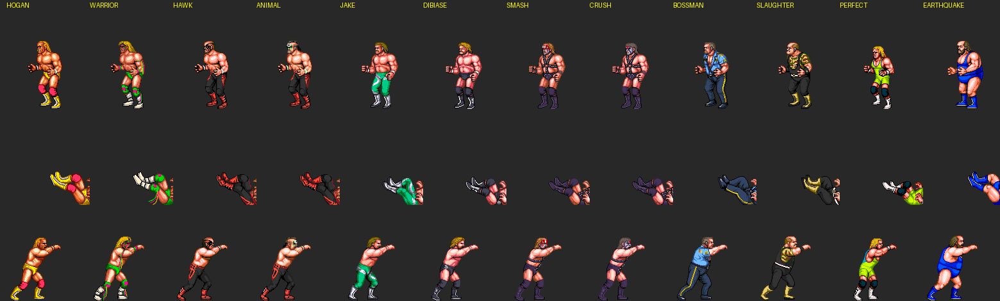

# AI art pipeline — custom wrestler art surfaces & the codex recipe

Status 2026-08-24 (V505). Proven end-to-end on superstars slot 15
("HONKY TONK MAN", clone_of 8/Earthquake): 20 AI poses live in-game,
rest fall back per-pose to base art.

## The proven generation recipe

One `codex exec` request per frame (or per sheet), two input images:

1. **Gray mannequin ref** — the engine's own render of the BASE wrestler's
   pose (`wfengine --art-job BASE DIR`, 256x256 RGBA, origin 128,176),
   desaturated to pure grayscale (keep alpha + outlines). Stripping the
   base's identity stops it fighting the anchor; pose fidelity improved
   measurably (pose-0005 A/B, 2026-08-24).
2. **Anchor** — one approved high-res frame of the TARGET character
   (currently anchor v5: red jumpsuit, light skin edges). The anchor is
   the only identity source; regenerate it only on a design change and
   re-approve by eye.

Prompt template (per-frame; sheets add the grid-layout sentence):

> The first image is a grayscale POSE REFERENCE mannequin. The second
> image is the TARGET CHARACTER: <character description>, 16-bit arcade
> pixel-art style. Use your image generation tool once, immediately, to
> draw the target character in the mannequin's pose. Copy the
> mannequin's pose EXACTLY, limb by limb: the exact leg positions and
> stride (which leg is forward, the bend of each knee, foot placement),
> the forward lean of the torso, the exact arm and hand positions.
> EXACT same body proportions as the mannequin, same framing.
> Outline rules: black outlines ONLY on the black hair; the <suit> gets
> DARK <suit-colour> outlines; exposed skin (face, chest, arms, hands)
> gets LOW CONTRAST outlines — a medium warm orange only slightly darker
> than the skin's shadow shading, never black, never dark brown. The
> output must have a FULLY TRANSPARENT background — real PNG alpha, not
> a painted checkerboard, not a background colour. Then stop.

Model behaviour (all confirmed repeatedly):
- Single figures: real alpha ~half the time, else a PAINTED checkerboard.
  Sheets: NEVER real alpha (checkerboard or flat colour) — key locally.
- The checkerboard flood-keys perfectly from the borders (light >200 RGB,
  4-connectivity); dark outlines seal the figure so interior whites are safe.
- Sheets: 2x2 (512px cells) = near-single quality, 4/4 hit rate observed;
  4x4 (256px cells) = usable, ~87% pose-accurate, softer detail. Ask for
  "no figure touching the image edges" (stops edge clipping) and expect
  the occasional dropped/merged cell at 4x4.
- Pose misses collapse to a generic hero stance; re-roll as singles.
  Ambiguous refs (hidden head, tangled limbs) miss most often.

Local post-pass (no credits): whole-image checker flood-key ->
largest-connected-component bbox per cell (>=~400px at 1254², keeps the
whole figure, drops stray specks — never percentile-crop) -> hard alpha
(threshold 128) -> NEAREST downscale to the ref figure bbox height ->
paste on a 256 canvas at the ref bbox feet line / x-centre ->
`wfengine --art-ingest DIR SLOT DST` -> `--pack-profile`.

## Body templates (body_class) — 2026-08-25

The 12 stock bodies are FIVE templates, not twelve. Two independent
sources agree exactly:

1. The ROM's own size class: `behind_grab_class` (0x18DFA, 12 bytes,
   `data/tables/wrestler/behind_grab_class.json`), used by the behind-grab
   moves 0x52/0x53/0x1D for the held man's x offset.
2. Silhouette overlap of `--art-job` mannequins at the SAME pose index:
   within a class mean IoU 0.92–0.98 (same body, repainted); across
   classes 0.63–0.83.

| class | name | wrestlers | standing bbox |
|---|---|---|---|
| 0 | medium | Hogan, Warrior, Hawk, Animal | 54x106 |
| 1 | lean | Jake, DiBiase, Smash, Crush | 57x104 |
| 2 | small | Mr Perfect (alone; nearest = class 1 at 0.75) | 48x99 |
| 3 | heavy | Boss Man, Slaughter | 53x104 |
| 4 | giant | Earthquake (alone; Boss Man is NOT his body, 0.80) | 56x106 |

 — three pose indices per wrestler,
grouped by class. Pose index N is the same semantic frame for every
wrestler (the fall, the jab); counts differ (368–387) only in the
signature-move tail. Weapons/ropes are NOT a body category — they are
foreign cells baked into some poses (the weapon overlay work below).

Consequences, wired in V582:
- `wrestler.json` carries `"body_class": N` next to `clone_of`. The Forge
  writes it (derived from the base) and shows the template + its
  members beside the base picker. `--pack` refuses a `body_class` that
  disagrees with `clone_of`'s class and warns when it is missing.
- Engine: `eng_ws_body_class(id)` / `eng_body_class_name()` (package.c);
  anim.c's behind-grab offsets read through it.
- Pipeline direction: mannequins, weapon masks and victim maps are
  per CLASS in principle (any member's refs fit any other member), so
  build them 5 times, not 12. Pick a clone's base by the body you want:
  a real Honky Tonk Man is a class 0/1 body, not Earthquake's (slot 15
  today sits on class 4 — revisit).

### Class template inventory — `wfengine --class-inventory data/classes.json` (V583)

Facts the inventory rests on (verified 2026-08-25):
- **Pose id N is the same frame on every wrestler** (the move table 0x12614
  is shared; rendered side by side, ids that looked different are partial
  overlay poses — hands, one leg, a pinned torso). 552 ids exist; 286 are
  in all 12 streams.
- **Hitboxes/hurtboxes/proximity boxes are per MOVE, never per wrestler**
  (`hit_record` 34x7, 11 attacker + 11 victim boxes, 17 prox boxes). Holds,
  throws and pins have no hitboxes. The only class-keyed number in the ROM
  is the behind-grab x offset (−40/−40/−32/−44/−40 px by the VICTIM's
  class, three moves) — cosmetic body-spacing. So a class template with
  all 552 ids makes every move legal on every body; "Hogan's move" is just
  his `ws_move_map` row plus the art existing.
- The ROM bakes two-man frames as HOLDER x VICTIM (each holder pose has up
  to 12 partner variants with that victim's body). Each member's victim
  body was drawn separately — same-class silhouettes are near-identical
  (IoU 0.96) but not pixel-equal, so one member's deduped set IS the
  class victim template.

Per class (`data/classes.json`; universal = any member is the ref;
class = a member has it; borrowed = no member has it, ref is the nearest
class's frame and needs a ONE-OFF AI conversion onto this body with the
class's stock member as identity anchor — done once per class, never per
skin):

| class | universal | class | borrowed | victim template (member) |
|---|---|---|---|---|
| 0 medium | 286 | 159 | 107 | 286 (Hogan) |
| 1 lean | 286 | 190 | 76 | 268 (Jake) |
| 2 small | 286 | 82 | 184 | 278 (Perfect) |
| 3 heavy | 286 | 119 | 147 | 292 (Boss Man) |
| 4 giant | 286 | 93 | 173 | 299 (Earthquake) |

(victim template includes the same-holder frames, split by holder
subtraction — V584; nothing is unsplittable.)

Plan built on it (user 2026-08-25): stock wrestlers become skin 0 of their
class (extracted body-only: victim cells split by pal nibble, weapons/
ropes tagged out); borrowed ids converted once per class; sprite.c gets
ONE composition path (holder skin pose + victim skin pose + weapon/rope
overlays, position-preserving) for stock and clones alike; a per-(pose,
holder class, victim class) offset table authored in an editor
"corrections" page replaces the 5-entry behind-grab spacing where needed.
The tagger is then for WEAPONS and ROPES only (no counterpart to subtract).

## Stock as skin 0 — `--export-skin BASE DIR` / `--verify-skin BASE DIR` (V593)

Every stock wrestler exports into the skin-package layout and the
decomposition is PROVEN LOSSLESS: `--verify-skin` recomposes all of his
two-man frames from the parts and compares them in colour with the baked
ROM frames — all 12 bases, 8,864 frames, 0 mismatches (2026-08-25).

Layout (`tools/export_skin.c`):
```
DIR/skin.json               class, base, name, canvas 256, origin (128,176)
DIR/palette.json            16 pens
DIR/frames/pose_NNNN.png    BODY-ONLY single frames (weapon/rope cells out)
DIR/victims/vict_NNNN.png   him as VICTIM, one per class victim id, drawn
                            in HOLDER coordinates (paste at the holder origin)
data/classes/C/victmap.json [holder row (12 = own base), holder pose] -> victim id
                            for the whole class; ids deterministic
                            (representative member first, others append)
```
Facts the round trip rests on (each checked by the verifier):
- a composed frame's HOLDER cells are exactly the holder's own single
  pose — same records, same order — so the victim cells are "everything
  not in the own list" (`eng_pkg_victim_mask`, now holder subtraction for
  every frame; it also absorbs the ~20 ROM cells whose bank is a third
  wrestler's or, by chance, the holder's — Hawk-holds-Jake pose 265);
- the two bodies INTERLEAVE in draw order (hvh 2647 frames, vhvh 959,
  hvhvh 306 ...), so a victim frame is not one flat layer: the stock
  composed cell list is the DEPTH TEMPLATE — each cell paints its 16x16
  footprint from the flat frame of its side, in stock order. Exact for
  stock cuts; for an AI cut the runtime orders the skin's cells by which
  stock cell footprint they fall in (to build in sprite.c);
- Hawk/Smash/Crush carry two pens of one colour, so verification is in
  colour (a PNG cannot keep pen identity; a skin is paint).
### The class template job dir — `wfengine --class-template C DIR` (V596)

What a NEW SKIN of class C must fill; the generator's job directory:
```
DIR/manifest.json     class, members, representative; every pose id with
                      kind universal / class / borrowed and its ref wrestler;
                      victim ids with holder+pose; counts
DIR/ref/pose_NNNN.png body-only mannequins for ALL 552 single ids —
                      borrowed ones come from the nearest class's member
                      (class 2: 43 DiBiase, 42 Jake, 21 Smash ...) and need
                      the ONE-OFF conversion onto this body
DIR/ref/pose_1024+V.png  victim mannequins, one per class victim id, in
                      holder coordinates (277..391 per class)
DIR/victmap.json      art-ingest format [1024+V, holder row, pose]; row 12
                      = "the skin's OWN base holds him" (mirror holds) —
                      vict2 / eng_pkg_vict understand row 12 (V596)
DIR/out/              the skin's frames, same names; then
                      --art-ingest DIR SLOT DST as for any job
```
Counts per class: single 552 (borrowed 107/76/184/147/173), victim
376/391/277/357/299. Identity check: copying ref/ to out/ and ingesting
class 4 yields 552 poses + 776 vict entries (60 SELF). The template also
carries the representative's aisle walk-in cells (768+). **Skins tab
(V597): a skin is per BODY CLASS** — `skin.json` carries `class` (+ `base`
= the representative, for older readers); "1 Refs" runs
`--class-template C jobs/<skin>`; the Forge's skin dropdown offers every
finished skin whose class matches the slot's base (pre-V597 skins count
as their base's class). `--art-job BASE` remains as the per-base tool.

### Runtime: ONE composition path — `eng_compose()` (package.c, V594/V595)

sprite.c's package path now calls `eng_compose(holder, pose, flip,
victim)` for stock and clones alike (aisle walk-ins keep their own path):
- TEMPLATE = the stock composed list of (holder base, pose, victim base)
  — or the holder base's own list for a single pose — used as the DEPTH
  template; each template cell says which side draws at that point.
- HOLDER = the clone's own pose when he has it, else the template's
  holder cells (stock: identity). VICTIM = the clone's vict2 frame for
  (holder base, pose) when he has it, else the template's victim cells.
  OVERLAY = the template's weapon cells (bank 15) verbatim; rope cells
  (bank 14) only for a stock holder.
- placement: exact record match first (a stock cut is 1:1 -> output
  bit-identical, regress digest unchanged 18ffaf29d9dc208b), else the
  first template cell of the side whose 16x16 footprint holds the
  record's centre (an AI cut); unmatched records draw last.
- `src[]` per record drives sprite.c's bank rules (HOLDER_OWN /
  VICTIM_OWN -> the clone's borrowed bank; VICTIM base cells -> the
  palette-only clone's bank; overlay keeps bank 15) — unchanged rules,
  expressed per source instead of per nibble test.
- `eng_pkg_pose()` for clones (tools, editor pose browser) routes through
  it too; `--poses ID FIRST N OUT` takes `WF_PARTNER=<victim id>` (clones
  allowed) to render two-man frames.
Verified: stock digest identical; Honky holding Hogan / Earthquake
holding Honky / Honky holding Honky (mirror variant) render through the
one path; a clone without a vict2 frame falls back to the base's victim
cells for that hold.

## Art surfaces a complete wrestler needs

| surface | where it lives | clone support today |
|---|---|---|
| in-ring body poses (379 + partner variants) | wrestler pak `poses2`, rows 0..11; sprite.c row<12 pak hook | DONE — AI pipeline, per-pose base fallback |
| aisle walk-in (FRONT view, toward camera) | shared sprite row 0x40+base, cells 0..3 (+4..7 strut for rows 0x40/41/47/49), 12 ticks/cell, `aisle_pose_cells`; palettes `ws_aisle_palette_banks` | DONE except art (V511): refs exported by `--art-job` (`ref/pose_0768..0775.png`; a cell can be absent = 0xFFFE); runtime virtual aisle rows serve pak pose 768+cell with base-stream fallback; generation = same mannequin recipe |
| select portrait 80x80 | mod `select/NN.png` (corner px = panel pen 15) | DONE — codex portrait recipe below; installed for slot 15 (v2, digitized-photo style approved 2026-08-24) |
| title-win card portraits | interlude.c row 0x4D cells, per id 0..0xB tables | DONE V645: pak pose 810 (class template ref = the rep's card, portrait recipe on magenta), own palette ("cellpal"), virtual row CLONE_TROW0; ending name cards use the same row |
| continue-screen face cards | campaign.c row 0x30+id cells 0..7 (six 80x80 cards, crowd wall + border, own palettes) | DONE V645: pak poses 800+cell (portrait recipe keeps the wall/border/expression), "cellpal" per card, virtual row CLONE_CROW0 (eng_sprite_cont_row); the base's cards until his exist |
| HUD 3x3 portrait (FG0) | hud.c 0x77D8, ws_portrait_word | DONE V645: derived from the clone's select cell at first draw (80->24 box, quantized to the base's FG0 bank) into a free FG0 run (4 runs: up to 4 clones on the HUD) — no generation |
| title-card name lettering | row 0x4E cells per stock id | DECISION (user 2026-08-24): no bespoke lettering for new wrestlers — clones use the standard big font (eng_fg0_bigtext), stock keeps its sprite lettering |
| VS / match card (walk-in) | banner.c 0x98BA, art per `eng_ws_base(id) & 0xF` | base art; clone NAME announced (walkin.c) |
| aisle name plates | ROM blits 0x2503C per id | clones already draw their own name via fg0 bigtext (aisle.c 254..270) |
| LOD talk / belt scenes | stock-only interludes | base art, fine |

## Select portrait recipe (proven; v2 approved)

One codex request, two images: `-i data/select/04.png` (any stock portrait
as the STYLE EXAMPLE) `-i anchor.png` (identity). Key style wording that
made it match the stock look — describe the stock portraits as
**digitized photographs**, not pixel art:

> Note its style: it looks like a DIGITIZED PHOTOGRAPH of a real man —
> realistic facial structure, gritty photographic shading and skin
> texture, crunched down to a limited 16-bit arcade palette. NOT a
> cartoon, NOT clean illustration. [...] a REALISTIC photographic face —
> a real man's bone structure, stubble, skin pores and photographic
> lighting — as if a photo was scanned and quantized to a 16-bit arcade
> palette. Head and shoulders filling the frame, facing slightly left
> like the example, tight crop, dark simple background. Square image.

Install: BOX-downscale the 1254² result to 80x80 RGB ->
`mods/<profile>/select/<slot>.png` -> `--pack-profile`.

## Gotcha: stale clone-slot paks (fixed V508)

`--pack-profile` now DELETES `wrestlers/NN.pak` for any clone slot with
no `wrestlers/NN/wrestler.json` registration — previously removed
wrestlers kept ghosting the select screen from stale paks.

## Aisle walk-in for clones — BUILT (V511)

1. Refs (V509): pak pose ids 768+cell reserved = "aisle cells" (real
   pose table tops out at 0x235); `--art-job` renders the base's row
   0x40+base cells (0x4B walks as 0x4A) as `ref/pose_0768..0775.png`,
   decoded via the thinker + tbl_ra like sprite.c.
2. Runtime (V511): virtual clone-aisle rows CLONE_AROW0 (sprite.c);
   aisle.c sets `eng_sprite_aisle_row(raw)` for seats >= 12; the emit
   path decodes back to clone id + row 0x40+base and serves pak poses
   ENG_AISLE_POSE0+cell first (bank remapped to the clone's borrowed
   bank), ROM stream fallback — a clone without walkout art walks as
   the base automatically. `--art-ingest` carries out/pose_0768+ frames
   into the pak like body poses. `--row-cell ROW CELL PALID OUT`
   renders any shared-row cell for inspection/refs.

## Victim-body art (vict2) — SHIPPED 2026-08-25

Two-man composed frames are decomposed at runtime:
- Clone as HOLDER: constructed on demand (package.c) — the clone's own
  AI body + the victim cells split from the base's composed list by
  palette nibble.
- Clone as VICTIM: `--art-job` renders victim-only mannequins for every
  (holder row, pose) that can hold the base (synthetic ref ids >= 1024,
  victmap.json; holder==base skipped — both bodies share a palette and
  cannot be split; identical victim bodies DEDUPED by canvas hash,
  716 -> 284 for Earthquake). The generic run generates them; ingest
  routes them via victmap into a "vict" object; pack writes section
  "vict2"; sprite.c swaps them in for the base's victim cells inside the
  holder's frame, in the clone's palette. Save skin / Forge dress carry
  victmap.json with the frames.
- Arena: 0x6000 tiles/slot (SPR_TILES 0xD0000, marker nibble 4 bits).
- **Same-palette frames split by HOLDER SUBTRACTION (V584)**: when a
  holder holds his own base (both bodies carry one palette nibble) the
  holder's cells are identical — x, y, chain, flips, tile — in every
  partner variant of the pose (checked over all of Hogan's 70 two-man
  poses), so `eng_pkg_victim_mask()` (package.c) takes any sibling
  variant's holder cells and the remainder is the victim. Used by
  sprite.c (vict2 swap-in), the clone holder merge, `--art-job` (victim
  refs for holder==base are now produced: no more "two Earthquakes") and
  `--class-inventory` (0 unsplittable). Cell LAYOUT differs per victim
  (the tile cutter chained the same drawing differently), which is why
  record matching between victims does not work but holder subtraction
  does.
- **Mirror variants (V586/V587)**: for every same-holder split the
  leftover's 16x16 cell footprint is compared with the best sibling
  victim's (`art_split_check`, art_job.c). 68 frames across the roster
  (15/14/15/16/8 per class) come out under IoU 0.7 — inspected, they are
  NOT bad subtractions: the ROM drew the self-victim in a different
  place/pose (Slaughter p263: siblings lie to the left, the self-variant
  stands to the right; Earthquake p265: above vs below) so two same-colour
  bodies read apart. DECISION (user 2026-08-25): keep them as distinct
  template frames for fidelity — they are in each class's victim template
  and the compositor already serves the self variant when holder and
  victim share a base, as the ROM does. `--art-job` marks them (victmap
  4th element `1`, `mirror_poses`); ingest accepts the flag.

## Weapon / rope overlay system — SHIPPED V590 (2026-08-25), fully automatic

The ROM marks them by PALETTE BANK, so no tagging (human or AI) is needed:
- the 18 carry/swing poses 0x72-0x83 draw the stairs/box with nibble 15
  (the shared weapon bank — row 0x0F's palette, same as the loose
  tossed/floor weapon sprites);
- the 10 rope-climb poses 0x20-0x29 draw the 3-rope section with
  nibble 14;
- the body always carries the wrestler's own nibble. (A few stray cells
  use other banks — Hawk's LOD-duo poses 0x1CB/0x1CC carry Animal's, a
  handful of single cells elsewhere — they stay body, as the ROM draws.)

Wiring (package.c `eng_pkg_overlay(id, pose)`: one tag byte per OWN
record, ENG_OVL_WEAPON / ENG_OVL_ROPE, derived from the nibble; a
mod-layer `wrestlers/BB/overlay.json` `{"poses": {"114": [0,0,1,..]}}`
can override per pose — normally unnecessary):
- `--art-job` single-figure mannequins are BODY-ONLY (tagged cells
  skipped) — verified on all 28 poses: clean bodies, no furniture/ropes.
- runtime composite (eng_pkg_pose, clone with own art, single pose): the
  BASE's WEAPON cells are spliced around the clone's body — the run
  before the base's first body record draws behind, the rest on top.
  Verified: Honky (slot 15) carries the stock stairs/box. ROPES ARE NOT
  SPLICED (user decision 2026-08-25, V592): the arena already paints the
  ring ropes; the baked rope strip in the ten climb poses only let the
  man sit between them — dropped as unnecessary complication. Skins are
  body-only; clones climb in drawn over the arena ropes. TODO EXACT: 192 swing frames interleave
  (far arm behind the stairs, near hand in front) and a clone cut cannot
  be split that way — per-pose adjustments belong to the corrections
  page. Stock wrestlers keep their baked frames (identical output).
- Draw-order patterns in the ROM: `Wb` (0x72/0x77: weapon behind), `bWb`
  (all other carries/swings), `Rb` (0x20-0x23, 0x29), `RbR` (0x24),
  `bR` (0x25-0x27), `bRb` (0x28).
- PENDING: skins generated before V590 drew the weapons/ropes themselves
  (their refs had them baked in) — delete those outs (0x72-0x83,
  0x20-0x29) and regenerate from the body-only refs. Honky shows his own
  painted stairs under the real ones until then.
- Rule (user 2026-08-25): one-off core conversion work like this is
  engine/data code, NOT wfeditor (a long-term tool) — the editor tagger
  built earlier the same day was removed.
